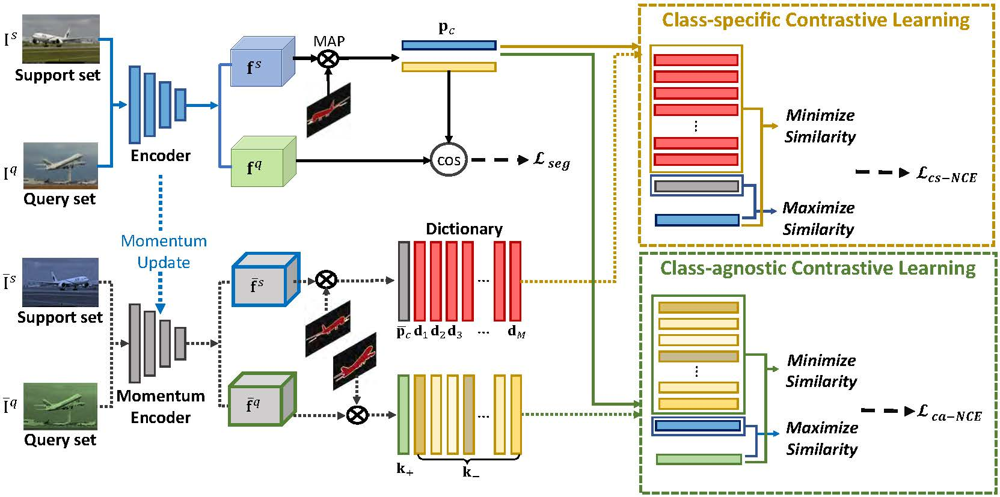

# Dual-Prototypical-Contrastive-Learning-for-Few-shot-Semantic-Segmentation
The official implementation of our paper Dual-Prototypical-Contrastive-Learning-for-Few-shot-Semantic-Segmentation

The source code will be released soon.

  

